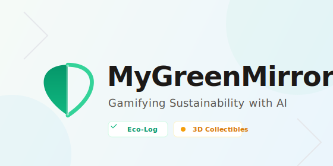

# MyGreenMirror
### Gamifying Sustainability with Multimodal AI

## Track
**Sustainability** / **Best Use of Gemini**

## Project Description
**MyGreenMirror** is a web application that transforms daily sustainability habits into an engaging, gamified experience using Google's Gemini models. Climate change often feels abstract; this app makes individual impact tangible and rewarding.

Users upload photos of recycling, videos of commutes, or audio logs of meals. The app uses **Gemini 2.5 Flash** to analyze multimodal inputs, identifying waste categories, estimating carbon footprints, and providing actionable eco-tips. It doesn't stop at analysis—it rewards users. High-scoring habits generate unique, collectible "3D Eco-Badges" created on the fly by **Gemini 2.5 Flash Image**, turning good deeds into digital art.

Features include a "Daily Habits" tracker for commute, food, and waste, and a local leaderboard to foster community competition. By visualizing impact through AR overlays and generative art, MyGreenMirror nudges users toward mindful living, one scan at a time. It demonstrates the power of multimodal AI to solve real-world problems by bridging the gap between awareness and action.

## How I created it
I built MyGreenMirror using **React** and **Tailwind CSS** for a responsive, mobile-first interface. The core intelligence is powered by the **Google GenAI SDK** (`@google/genai`).

1.  **Multimodal Analysis**: I used `gemini-2.5-flash` to process user uploads (Images, Video, Audio). The model identifies objects (e.g., plastic vs. glass), analyzes activities (e.g., "taking the bus"), and outputs structured JSON data containing carbon scores and bounding box coordinates for AR overlays.
2.  **Generative Rewards**: To gamify the experience, I utilized `gemini-2.5-flash-image`. When a user successfully logs a habit, the app takes the context (e.g., "Recycled 5 glass bottles") and generates a "3D Isometric Diorama" badge. This serves as a unique digital collectible.
3.  **Real-time Feedback**: The app uses the model's reasoning capabilities to provide instant "Action Plans" and recycling tips.

**Live demo**: [https://mygreenmirror-989792641782.us-west1.run.app/] 

**AI Studio Link**: [https://ai.studio/apps/drive/1xq8OT_qj_7fc9B07HsIDkA4is_06kdCD?fullscreenApplet=true] 

**30s walkthrough**: [loom-link]  

## Why it matters
Sustainability apps often suffer from high friction and low retention. MyGreenMirror solves this by:
1.  **Removing Friction**: Users can just snap a picture or speak; they don't need to manually enter data.
2.  **Visualizing Impact**: Carbon footprint is usually just a number. We turn it into art and specific, bounded object detection, making the invisible visible.
3.  **Social Motivation**: The leaderboard and badge system leverage social proof to encourage consistent eco-friendly behavior.
